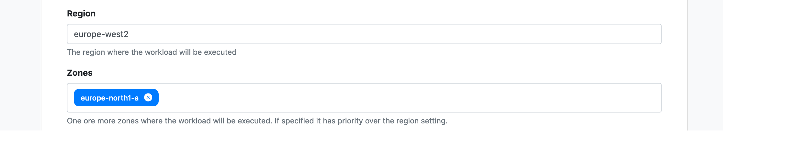

!!! tip "Requirements" 
    This guide assumes you have an existing [Google Cloud Account](https://console.cloud.google.com). Sign-up for a free account [here](https://cloud.google.com/).

# Cloud Life Sciences

Tower provides integration to Google Cloud via the [Cloud Life Sciences API](https://cloud.google.com/life-sciences/docs/reference/rest).

The guide is split into two parts, namely how to configure your Google Cloud account and enable the Google Life Sciences Application Programming Interface (API), followed by a guide on how to create a new Google Cloud compute environment in Tower. 

## Configuration of Google Cloud

### Create a new Google Cloud project or select an existing one.

Navigate to the [Google Project Selector page](https://console.cloud.google.com/projectselector2) and select an existing project or click **CREATE PROJECT**.

Enter a name for your new project e.g: "tower-nf". 

If you are part of an organization the location will be set by default to match your organization parameters.

### Make sure Billing is enabled for the project.

At the top left of the page, in the navigation menu (**≡**) click **Billing**. You can follow the enable billing instructions [here](https://cloud.google.com/billing/docs/how-to/modify-project).

### Enable the Google Life Sciences, the Compute Engine , and the Google Cloud Storage APIs.

Open [this link](https://console.cloud.google.com/flows/enableapi?apiid=lifesciences.googleapis.com%2Ccompute.googleapis.com%2Cstorage-api.googleapis.com) to enable all **three APIs** on for your project. 

Select your project from the drop down menu and click **Enable**. 

Alternatively enable these APIs manually by selecting the project on the top bar and visiting the API pages:

**1.** [Google Cloud Life Sciences API](https://console.cloud.google.com/marketplace/product/google/lifesciences.googleapis.com)

**2.** [Compute Engine API](https://console.cloud.google.com/marketplace/product/google/compute.googleapis.com)

**3.** [Google Cloud Storage JSON API](https://console.cloud.google.com/marketplace/product/google/storage-api.googleapis.com)

### Retrieve the Compute Engine Service account for your project

Click **Go to credentials** or visit this [link](https://console.cloud.google.com/apis/credentials/wizard?api=lifesciences.googleapis.com)

**1.** Select the **Cloud Life Sciences API** from the dropdown menu and select the radio button **Yes, I'm using one or both** to indicate we will use the Compute Engine API. 

**2.** Then click **What credentials do I need?**

**3.** A second screen appears to say you do not need any further credentials. Click **Done**.

You will be redirected to the **API & Services** page and the **Credentials** section. 

!!! note "Disclaimer" 
    Note a **Compute Engine default service account** has been created. 

**4.** **Copy** the email address as you will need this to configure **Google Storage**.

### Create a new key for the compute service account

**1.** Copy and click the **Email** of the service account.

**2.** Click "Manage Service accounts. 

**3.** Select **Add key** and **Create new key**.

**4.** Select **JSON** as the key type. Then, press **Create**.

A JSON key will be downloaded to your computer. 

This is the credential that is being used by Tower. You you will need it to configure the Tower compute environment. In the **Service accounts** page, you can see your key is now active and you can manage it from there.

### Create a Google Storage bucket.

In the top left of the page, there is a navigation menu (**≡**). Open it and then, proceed to click on **Storage** and **Create Bucket**.

### Configure your Bucket

!!! warning "Bucket Naming - No underscores _ !"
    Do not use underscores in your bucket name. Use hyphens instead.

**1.** Name your bucket, you will need this name to configure the Tower environment.

**2.** Select **Region** as the **Location type** and the **Location** for your bucket. You will need the **Location** to configure the Tower environment.

**3.** Select **Standard** as the **default storage class**.

**4.** Select **Uniform** as the **Access control**.

!!! tip 
    The Google Cloud Life Sciences API is available in limited number of [locations](https://cloud.google.com/life-sciences/docs/concepts/locations), however, these locations are only used to store metadata about the pipeline operations. The location of the storage bucket and compute resources can be in any region.

### Set Bucket permissions

**1.** In the **Storage** page, on the **Browser** section, click on the newly created storage.

**2.** Navigate to the **Permissions** tab.

**3.** Click on **+ Add**,

**4.** Copy-paste the service account email created above into the `new members box` and add the following roles:

**Storage Admin**

**Storage Legacy Bucket Owner**

**Storage Legacy Object Owner**

**Storage Object Creator**  

!!! tip "Congratulations!" 
    You have created a project, enabled the necessary Google APIs, created a bucket and a JSON file containing required credentials. You are now ready to set up a new compute environment in Tower.

## Tower configuration

!!! warning requirements 
    The following guide to configure Tower assumes you have JSON keys for a configured Google Cloud account. You will also need the name and location of the **Google storage** bucket.

The sections above shows how to configure Google Cloud.

To create a new compute environment for Google Cloud in Tower follow these steps:

**1.** In a workspace choose "Compute environments" and then, click on the **New Environment** button.

**2.** Enter a name for this environment, e.g. "Google Cloud Life Sciences (europe-west2)".

**3.** Select **Google Life Sciences** as the target platform.

**4.** Select the **+** sign to add new credentials. 

**5.** Name your credentials. 

**6.** Copy & paste the contents from the Google JSON key. 

If you do not have a JSON key follow [this guide](#4-enable-the-google-life-sciences-api-the-compute-engine-api-and-the-google-cloud-storage-api).

**7.** Select the [**Region** and **Zones**](https://cloud.google.com/compute/docs/regions-zones#available) where you'd like to deploy the workload. 

The **Google Storage** bucket created earlier should be accessible in the region.

**8.** You can leave the **Location** empty and Google will run the Life Sciences API Service in the closest available location.

**9.** Enter the bucket URL in the **Pipeline work directory** e.g. *gs://my-google-bucket-name*.

!!! tip 
    This is the name of your **Google Storage bucket** with the `gs://` prefix.

**10.** You can also opt-in to execute the workflow on the **Preemptible** instances to save further cost.

**11.** Optionally, settings such as **Use Private Address**, **Boot disk size**, **Head Job CPUs** and **Head Job memory** could be optimized as per the requirements of the workflow as well.

**12.** Select **Create** to finalise the creation of the compute environment.

Jump to the documentation section for [Launching Pipelines](../../launch/launchpad/).
