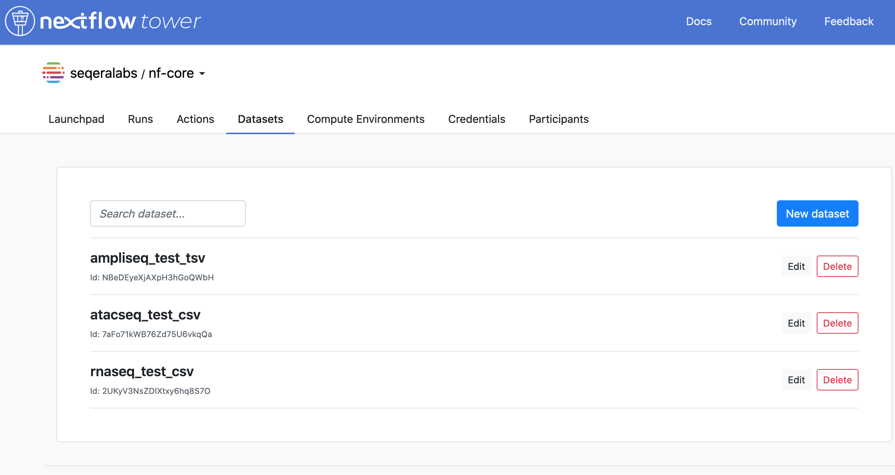

## Overview

The **Datasets** functionality in Nextflow Tower allows the users to store certain file formats (for example, `csv` or `tsv`) within an workspace and use this as an input for specific pipelines.

!!! note
    This feature is available only in the [organization workspaces.](../../orgs-and-teams/workspace-management).

## Creating a new dataset

To create a new dataset, please follow these steps 

1. Open the `Datasets` tab in your organization workspace.

2. Click on `New dataset` button to open the dataset creation dialog as shown below.

3. You can enter the **Name** and **Description** fields as per the nature of your dataset.

4. You can add the dataset file to your workspace using either drag and drop or by using the system file explorer dialog.

5. It is possible to customize the subsequent views for the dataset using `First row as header` option, to accomodate the situations where the first row contains the column names.

!!! warning
    The size of the dataset file should be less than 10Mb.

## Dataset versions

The **Datasets** functionality can accomodate multiple versions of a dataset. To add a new version for a dataset, please follow these steps 

1. Click on the _Edit_ option for the intended dataset.

2. In the Edit dialog, click on the _Add a new version_ button.

3. Upload the newer version of the dataset and click on _Update_.

!!! warning
    All subsequent versions of a dataset must be in the same data format as the initial version of the dataset.

## Using a dataset

To use a dataset with the saved pipelines in your workspace, please follow these steps 

1. Open any pipeline from the [Launchpad](../../launch/launchpad) containing a [pipeline-schema](../../pipeline-schema/overview).

2. Click on the input field for the pipeline, removing any default value. 

3. Pick the right dataset for your pipeline

!!! warning
    The Datasets shown in the dropdown menu depends upon the validation specified in your [pipeline-schema](../../pipeline-schema/overview).

