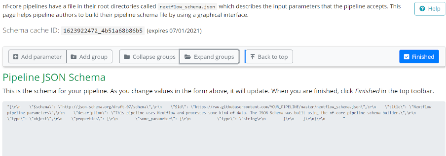
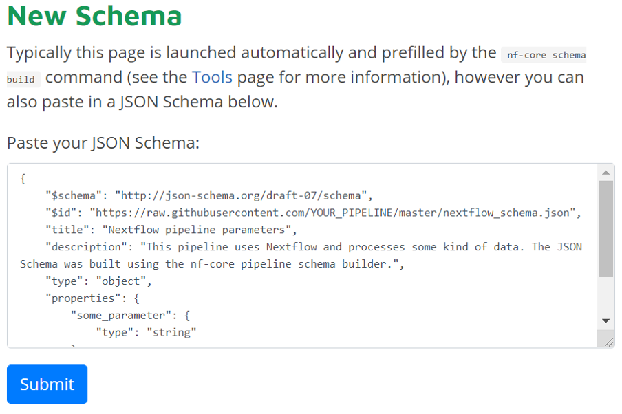

## Overview

This page will give you a detailed description of what pipeline schema files are, why they are used and to give you an in-depth description of how to build and customize your own Pipeline JSON schema file. 

## What is a Pipeline schema? 

In short, the main use of pipeline schema is to describe the structure and validation constraints of your workflow parameters. Schemas in general are used to validate parameters before use to prevent software/pipelines failing in unexpected ways at runtime.

## Why do you need a schema file for your pipelines or software applications?

Pipeline schema file is used to describe the different paraments used by the Nextflow workflow and the input parameters that the pipeline accepts.

Nextflow Tower uses this file to automatically generate the pipeline inputs form and validate
the user provided parameters in a user friendly way.

## How can I build my own Pipeline schema file for my Nextflow pipelines?

The pipeline schema is based on [json-schema.org](https://json-schema.org/) syntax, 
therefore it can be written with a simple text edition, even though can difficult for complex pipelines.

The [nf-core](https://nf-co.re/) project provides an handy tool that helps writing the schema 
file by running the `nf-core schema build` command in the pipeline root directoty.

It collects your pipeline parameters and gives you interactive prompts about any missing or unexpected parameters. If no existing schema is found, it will automatically create a JSON schema file for you.

For more information, please follow [this link](https://nf-co.re/tools/#build-a-pipeline-schema).

## How can I individualize or edit the automatically created schema file?

Once your pipeline schema file has been built with the `nf-core schema build`, the tool can send the schema to the nf-core website so that you can use a [graphical interface](https://nf-co.re/pipeline_schema_builder) to organize and fill in the schema. 

The tool also checks the status of your schema on the website and once complete, it saves your changes to the file locally. 

Furthermore, you will get a **Build ID/Schema cache ID** as can be seen above, so if for any reason you already ran the `nf-core schema build` command and forgot to save your changes, you can resume editing your JSON schema file by using [our schema builder] (https://nf-co.re/pipeline_schema_builder). 

If the tool **does not** automatically take you to the nf-core website to customize your JSON schema file, please click on [the following link] (https://nf-co.re/pipeline_schema_builder). 

**1.** Open the link above.

**2.** Copy the schema code you have received into the box below "**Paste your JSON Schema**" in the "**New Schema**" section. 

**3.** Click on "**Submit**". 

You will be automatically redirected to the JSON schema builder website, where you can then add parameters, groups and much more. 

Once you are done editing the schema file, you can click on "**Finished**". 

## Can I use the pipeline schema builder for pipelines outside of nf-core? 

Yes. The schema builder is a tool created by the nf-core community to make the creation and editing of Pipeline schema files easier for developers. Thus, it can be used to create any kind of pipeline. 

## What changes can I make to my schema file with the pipeline schema builder?

You can add parameters such as identifiers (e.g. `productId`), a product name (e.g. `productName`), a selling cost and tags. Additionally, you can define the properties of the identifiers and add groups. 

For a more in depth guide on schema files, please follow [this](https://json-schema.org/learn/getting-started-step-by-step.html) and [this](https://json-schema.org/specification.html) link.

If you click on the "**Help**" button in the pipeline schema builder website, you will also be able to get an in-depth explanation of the possible parameters and tips on how to create a schema that fits your needs. 
